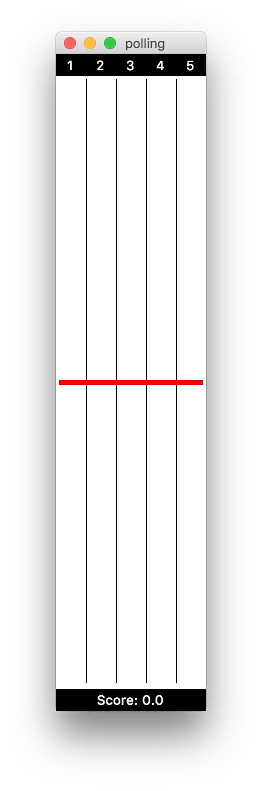

# Inventory AI

This is an operations research puzzle but also a game. The game is formulated as a multiclass inventory-production problem with Poisson demands and constant production, both in continuous time. Certain cost functions are defined (for turning on and off, for switching between classes, etc.) and what we're gonna do is to find the optimal routing policy such that the long-run average cost is minimized. For a more formal model definition refer to my Bachelor's thesis.

## Interface

Both human-playing and AI-learning modes are implemented. A nice GUI can be turned on during learning of AI, which will be on by default when you play by yourself. For a system with 5 classes, this is what you'll see:



where at the top you can see numbers from 1 to 5, corresponding to button `1` to `5` on your keyboard (so you can actually decide which class to produce in each step), and at the bottom is your current score. Either boundary the red inventory level bar touches, upper or lower, the system is deemed failed. Try play by yourself, or implement a better AI (heuristic, reinforcement learning, whatever)!

## Dependencies

To run this game you'll need `Python 3.x` with `TkInter`, `Pandas` and `Numpy` pre-installed.

## How-to-play

For human playing:

```bash
python3 polling.py
```

For AI learning (e.g. DQN):

```bash
python3 run_dqn.py
```
